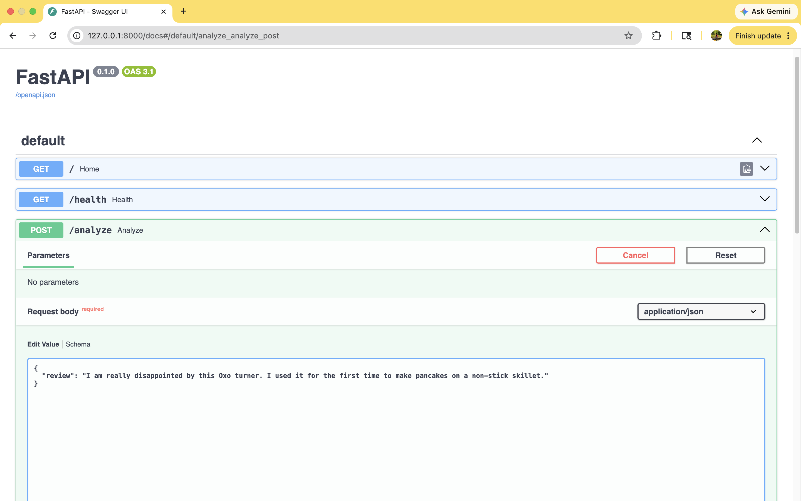
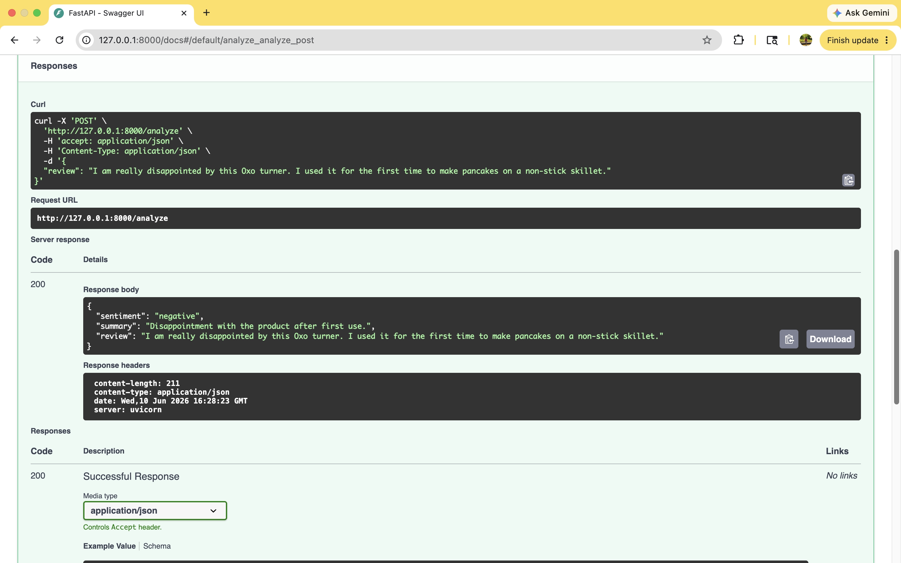
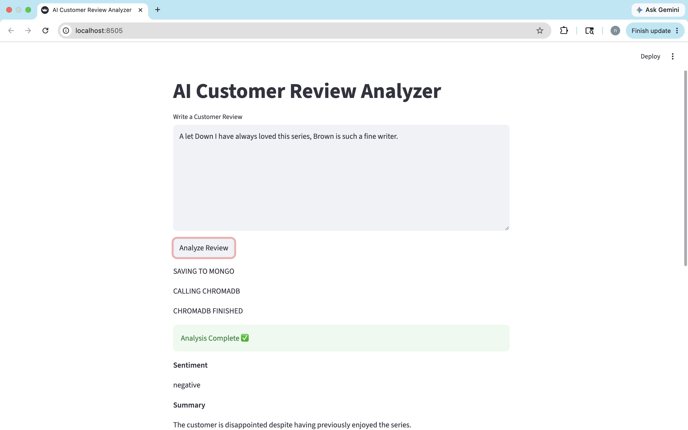
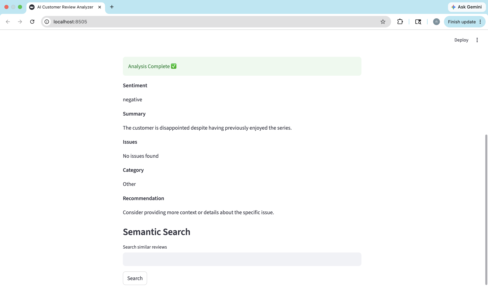
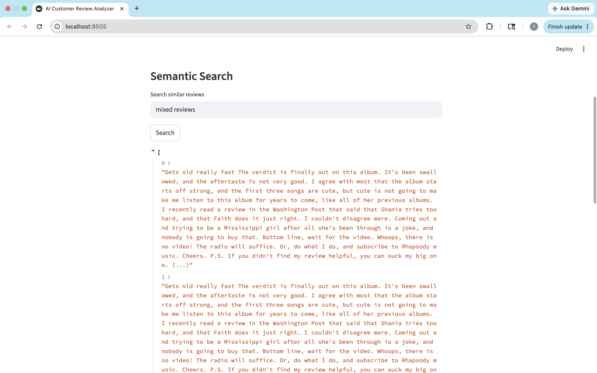
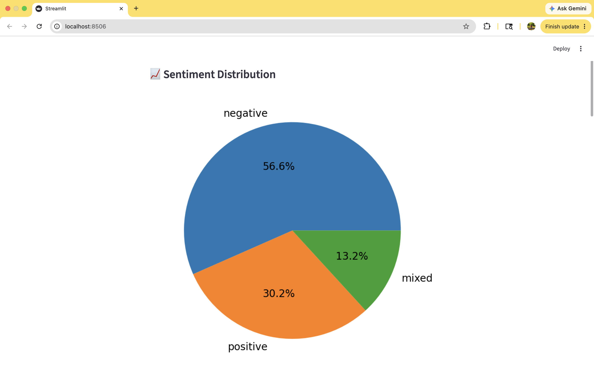
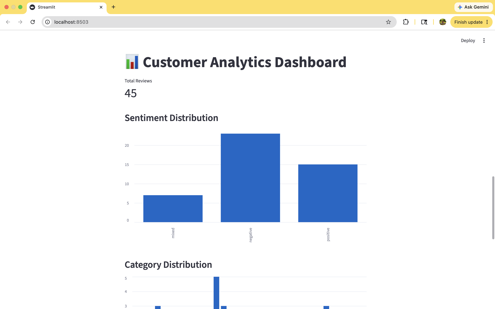
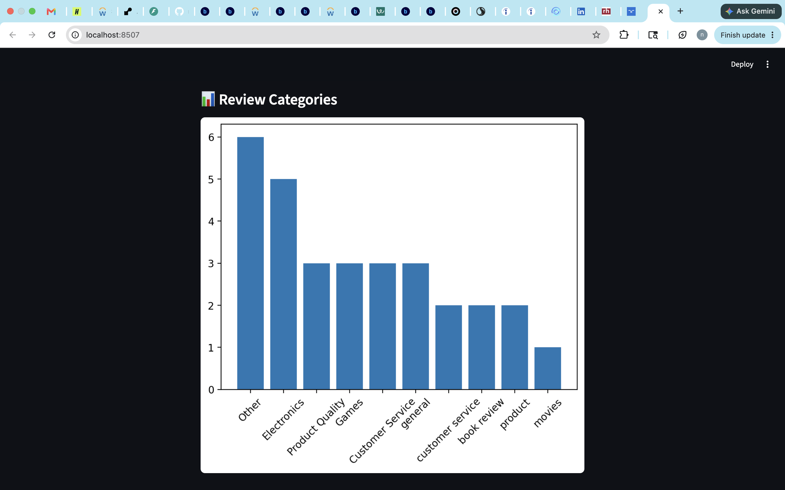

#  AI Customer Review Intelligence System

> **Live API →** [ai-customer-review-intelligence-system.onrender.com](https://ai-customer-review-intelligence-system.onrender.com/docs)

An end-to-end **Generative AI system** that analyses customer reviews in real time — detecting sentiment, extracting key issues, generating summaries, and enabling semantic search across review data.

Built with **Python · FastAPI · OpenAI · ChromaDB · MongoDB · Streamlit** and deployed to production on **Render**.

---

## Live Demo


| Endpoint | Description |
|---|---|
| [`/docs`](https://ai-customer-review-intelligence-system.onrender.com/docs) | Interactive API — try it live |
| [`/health`](https://ai-customer-review-intelligence-system.onrender.com/health) | Health check |
| [`/analyze`](https://ai-customer-review-intelligence-system.onrender.com/docs) | Analyse a single review |

---

##  What It Does

Send any customer review → get back structured AI-powered insights in JSON format:

```json
Input:
{
  "review": "The product quality was amazing but delivery took 3 weeks!"
}

Output:
{
  "sentiment": "positive",
  "summary": "Customer loves product quality but experienced slow delivery.",
  "issues": ["slow delivery"],
  "category": "product",
  "recommendation": "Improve shipping speed to enhance overall experience."
}
```

---

## System Architecture

```
User / Streamlit UI
        ↓
   FastAPI Backend          ← REST API with Pydantic validation
        ↓
   LLM Pipeline             ← OpenAI GPT-4o-mini
        ↓
  ┌─────────────┐
  │  ChromaDB   │           ← Semantic search (embeddings)
  │  MongoDB    │           ← Review storage
  └─────────────┘
        ↓
  Structured Response       ← sentiment, summary, issues, category
```

---

## Key Features

- **Real-time sentiment analysis** — positive / negative / neutral classification
- **LLM-based summarization** — one-sentence summary of each review
- **Issue extraction** — automatically pulls out key problems mentioned
- **Semantic search** — find similar reviews using ChromaDB embeddings
- **Category detection** — auto-classifies reviews by topic
- **Recommendations** — AI suggests improvements based on feedback
- **Production logging** — structured logs with Loguru
- **Error handling** — graceful failure at every layer

---
## System Screenshots

### FastAPI - Request(cURL))


### FastAPI - Response(Analysis Output)


---

### Streamlit Application

### Input Review Interface


### AI Analysis Output


### Semantic Search


---
### Dashboard Analytics

### Sentiment Distribution




### Category Distribution



##  Tech Stack

| Layer | Technology |
|---|---|
| **Language** | Python 3.11 |
| **API Framework** | FastAPI |
| **LLM** | OpenAI GPT-4o-mini |
| **Vector Database** | ChromaDB (embeddings + semantic search) |
| **Database** | MongoDB |
| **Frontend** | Streamlit |
| **Logging** | Loguru |
| **Deployment** | Render (cloud) |
| **Version Control** | Git + GitHub |

---

##  Project Structure

```
CustomerAnalysis/
├── backend/
│   ├── main.py          ← FastAPI app — all endpoints
│   ├── llm_analyzer.py  ← OpenAI LLM calls + JSON parsing
│   ├── mongo_db.py      ← MongoDB connection + operations
│   ├── vector_db.py     ← ChromaDB embeddings + search
│   ├── pipeline.py      ← end-to-end analysis pipeline
│   ├── logger.py        ← structured logging setup
│   └── test_main.py     ← pytest unit tests
│
├── screenshots/             
│  ├──fastapi
│  ├──streamlit
│  └──dashboard
│
├── dashboard.py     ← Streamlit UI 
├── requirements.txt
└── README.md
```

---

##  Getting Started

### 1. Clone the repo
```bash
git clone https://github.com/nbisoyi3024/customer-review-ai
cd customer-review-ai
```

### 2. Create virtual environment
```bash
python -m venv .venv
source .venv/bin/activate    # Mac/Linux
.venv\Scripts\activate       # Windows
```

### 3. Install dependencies
```bash
pip install -r requirements.txt
```

### 4. Add your API keys
Create a `.env` file in the root folder:
```
OPENAI_API_KEY=your_openai_key_here
MONGODB_URI=your_mongodb_connection_string
```

### 5. Run the API
```bash
uvicorn backend.main:app --reload
```

### 6. Open in browser
```
http://127.0.0.1:8000/docs
```

---

##  Running Tests

```bash
pytest backend/test_main.py -v
```

Expected output:
```
backend/test_main.py::test_home                  PASSED ✅
backend/test_main.py::test_health                PASSED ✅
backend/test_main.py::test_analyze_empty_review  PASSED ✅
```

---

##  API Endpoints

### GET /
Returns API status message.
```json
{"message": "Customer Review Intelligence API"}
```

### GET /health
Health check — confirms API is running.
```json
{"status": "ok"}
```

### POST /analyze
Analyse a customer review and return structured insights.

**Request:**
```json
{
  "review": "Great product but the packaging was damaged."
}
```

**Response:**
```json
{
  "sentiment": "positive",
  "summary": "Customer likes the product but had packaging issues.",
  "issues": ["damaged packaging"],
  "category": "product",
  "recommendation": "Improve packaging quality."
}
```

---

##  How Semantic Search Works

1. Each review is converted to a **vector embedding** using OpenAI
2. Embeddings are stored in **ChromaDB**
3. When searching, the query is also embedded
4. ChromaDB finds the most **semantically similar** reviews
5. Results are returned ranked by similarity score

This means searching "slow shipping" also finds reviews mentioning "late delivery" and "package took weeks" — even without exact keyword matches.

---

##  What I Learned Building This

- How to design **modular AI architectures** — each layer is independent and testable
- How to handle **LLM output parsing** reliably — validating JSON structure
- The difference between **keyword search** (MongoDB) and **semantic search** (ChromaDB)
- How to add **structured logging** so production issues are easy to debug
- How to **deploy a FastAPI app** to cloud with environment variable management

---

##  What's Next

- [ ] Analytics endpoint — top 10 reviews + category breakdown
- [ ] Add streaming responses (real-time token output)
- [ ] Async batch processing (100+ reviews at once)
- [ ] GitHub Actions CI/CD pipeline
- [ ] LLM evaluation with RAGAS
- [ ] Azure OpenAI integration

---

## Built By

**Niharika Bisoyi** — AI Engineer | Python · LangChain · FastAPI · GenAI

🔗 [LinkedIn](https://www.linkedin.com/in/niharika-bisoyi/) · [GitHub](https://github.com/nbisoyi3024) · [Live API](https://ai-customer-review-intelligence-system.onrender.com/docs)

---

 If you found this project useful, give it a star!
